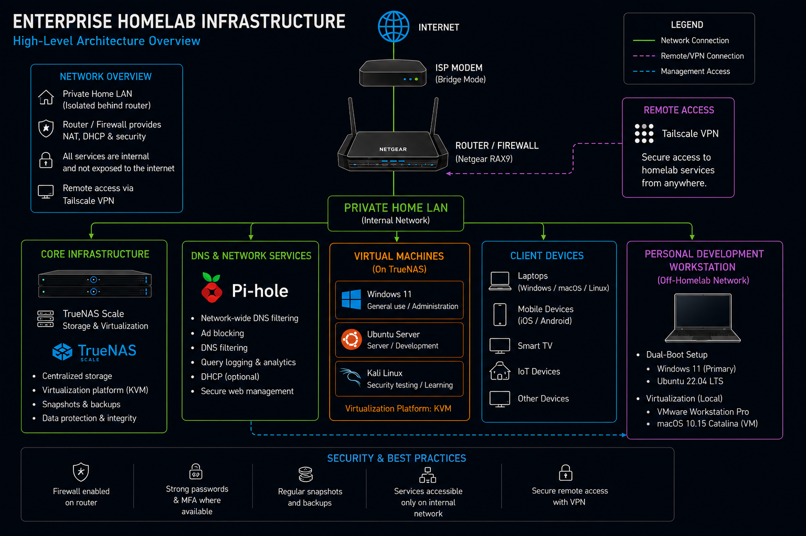

# 🏠 Enterprise Homelab Infrastructure



> A documented enterprise-style homelab built to develop practical experience in infrastructure administration, virtualization, networking, Linux, Windows, and cybersecurity.

---

# 📖 Overview

This repository documents the architecture of my personal homelab environment. The lab is designed to simulate a small enterprise network while providing a platform to learn, test, and document real-world IT concepts.

The environment is centered around a **TrueNAS Scale** server that provides centralized storage and virtualization. Supporting services include **Pi-hole** for DNS filtering, **Tailscale VPN** for secure remote access, and multiple virtual machines used for administration, development, and security testing.

Unlike a production environment, sensitive implementation details have intentionally been omitted from this public documentation while preserving the overall architecture.

---

# 🏗️ Architecture

The network is organized into the following components:

```
Internet
      │
 ISP Modem (Bridge Mode)
      │
 Netgear RAX9 Router / Firewall
      │
──────────────────────────────────
      │
 Private Home LAN
      │
├── TrueNAS Scale
├── Pi-hole DNS
├── Windows 11 VM
├── Ubuntu Server VM
├── Kali Linux VM
├── Client Devices
└── Personal Development Workstation
```

---

# 🖥️ Core Infrastructure

| Component | Purpose |
|------------|---------|
| ISP Modem | Internet connectivity (Bridge Mode) |
| Netgear RAX9 | Router, Firewall, DHCP, Network Security |
| TrueNAS Scale | Centralized Storage & Virtualization |
| Pi-hole | Network-wide DNS Filtering & Ad Blocking |
| Tailscale VPN | Secure Remote Access |

---

# 💾 TrueNAS Scale

The TrueNAS server is the foundation of the homelab and provides:

- Centralized storage
- KVM virtualization
- Snapshot management
- Data protection
- Virtual machine hosting

---

# 🖥️ Virtual Machines

## Windows 11

**Purpose**

- Windows administration
- Software testing
- General productivity

---

## Ubuntu Server

**Purpose**

- Linux administration
- Development
- Server services
- Automation

---

## Kali Linux

**Purpose**

- Security testing
- Networking practice
- Cybersecurity labs

---

# 🌐 DNS & Network Services

Pi-hole provides:

- Network-wide DNS filtering
- Advertisement blocking
- DNS query logging
- Optional DHCP services
- Secure web management

---

# 💻 Personal Development Workstation

My primary workstation is intentionally separated from the homelab infrastructure.

## Operating Systems

- Windows 11
- Ubuntu 22.04 LTS (Dual Boot)

## Local Virtualization

- VMware Workstation Pro
- macOS 10.15 Catalina Virtual Machine

> The macOS virtual machine runs locally on my workstation and is **not** hosted on the TrueNAS server.

---

# 📱 Client Devices

The homelab supports a variety of clients including:

- Windows laptops
- Linux systems
- macOS devices
- Mobile devices
- Smart TVs
- IoT devices

---

# 🔐 Remote Access

Remote administration is provided using **Tailscale VPN**.

This allows secure access to homelab resources without exposing management services directly to the public Internet.

---

# 🛡️ Security Best Practices

The lab follows several security practices:

- Firewall enabled on the router
- Strong passwords
- Multi-factor authentication where supported
- Regular snapshots and backups
- Services accessible only from the internal network or VPN
- Routine system and firmware updates

---

# 🛠️ Technologies Used

## Infrastructure

- TrueNAS Scale
- KVM Virtualization
- VMware Workstation Pro

## Operating Systems

- Windows 11
- Ubuntu Server
- Ubuntu Desktop
- Kali Linux
- macOS

## Networking

- Pi-hole
- Netgear RAX9
- Tailscale VPN

---

# 🎯 Skills Demonstrated

This project demonstrates practical experience with:

- Infrastructure Administration
- System Administration
- Linux Administration
- Windows Administration
- Virtualization (KVM & VMware)
- DNS Administration
- Network Architecture
- VPN Configuration
- Storage Management
- Infrastructure Documentation
- Security Hardening
- Troubleshooting
- Backup & Recovery

---

# 🚀 Future Improvements

Planned enhancements include:

- VLAN segmentation
- Reverse proxy implementation
- Docker and Kubernetes workloads
- Monitoring with Grafana and Prometheus
- Active Directory lab
- Centralized logging
- SIEM integration
- Infrastructure as Code (Terraform/Ansible)

---

# 📂 Repository Structure

```
enterprise-homelab/
│
├── README.md
├── images/
│   └── Network_Diagram.png
├── docs/
├── diagrams/
└── screenshots/
```

---

# 📝 Notes

This repository is intended for portfolio and educational purposes. Sensitive configuration details, administrative endpoints, and internal management information have been omitted while preserving the overall architecture and design principles.

---

## 📄 License

This project is released for educational and portfolio purposes. Feel free to use the documentation style as inspiration for your own homelab projects.
